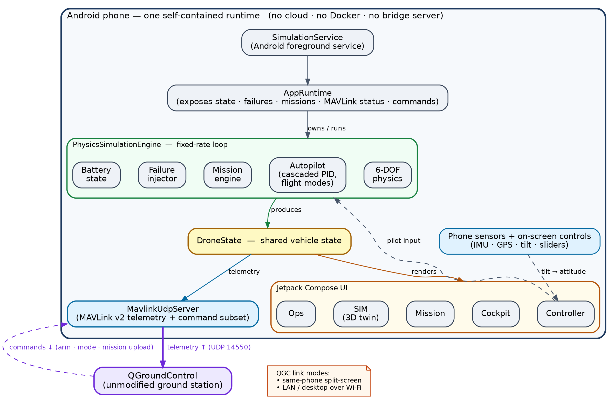
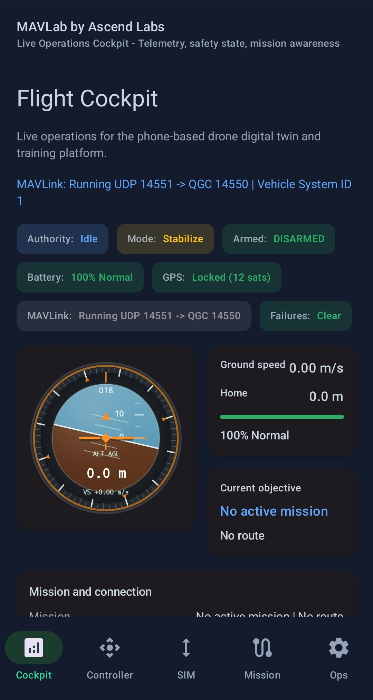
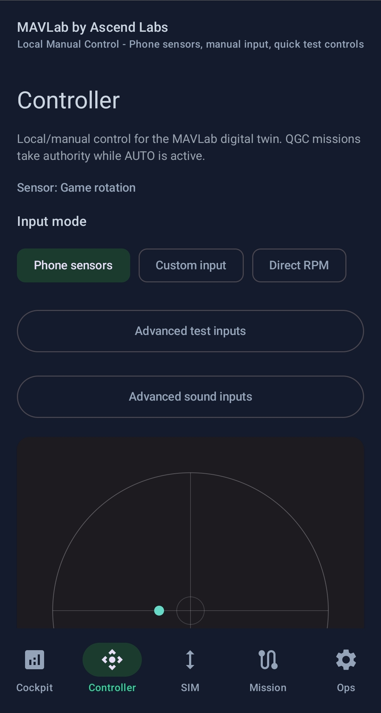
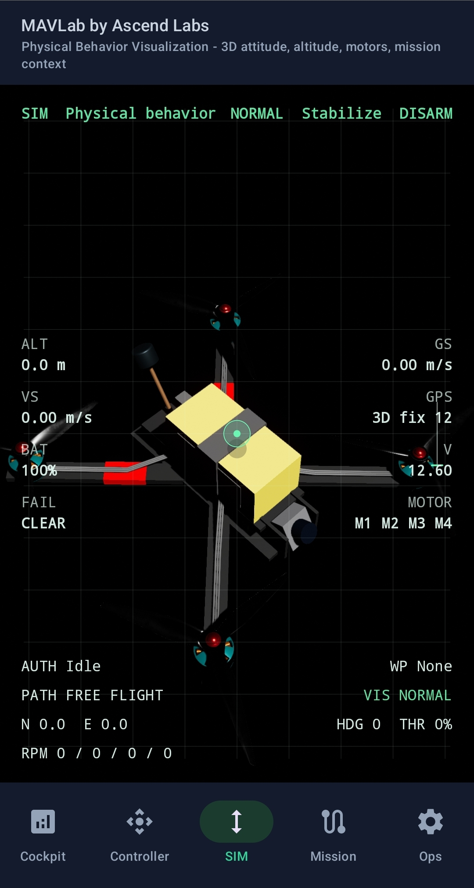
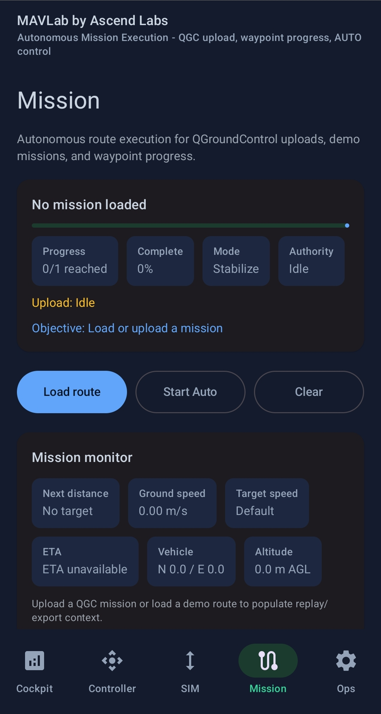
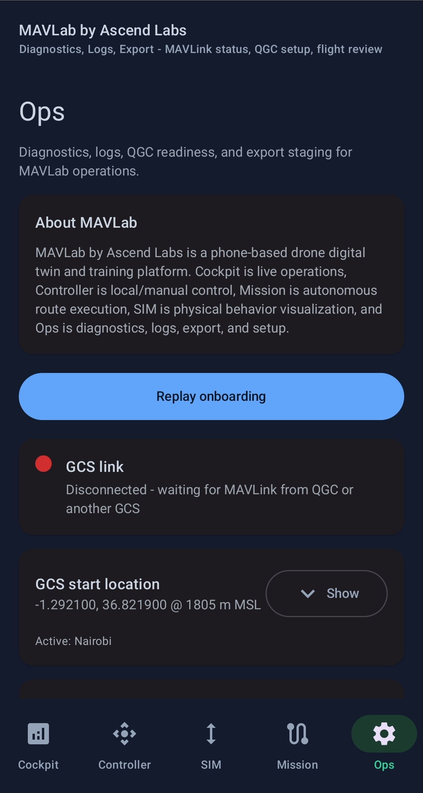

# MAVLab: A Phone-First Drone Digital-Twin Simulator for Flattening the Drone-Systems Learning Curve

**Ambrose Mweu Kioko**¹ (ambrose@fly-ascend.com) and **James Wainaina Kaira**¹ (james@fly-ascend.com)

¹ Ascend Labs, Ascend Drone Technologies Ltd., Nairobi, Kenya\
Corresponding author: Ambrose Mweu Kioko · Code: https://github.com/Labs-Ascend/MAVLab

## Abstract

Learning how drones sense, stabilize, communicate, navigate, and fail is gated by a steep infrastructure barrier: a beginner is typically pushed into ROS, Gazebo, ArduPilot or PX4 SITL, Docker, MAVProxy, and Linux networking before they can observe a single concept the drone itself embodies. This *tooling cliff* excludes learners who lack hardware, reliable connectivity, or systems-engineering background — a barrier felt acutely in low-resource and African educational contexts. We present **MAVLab**, a phone-first drone digital-twin simulator that runs its physics, autopilot, and a MAVLink server entirely on a commodity Android device, with no cloud, Docker, or bridge process required. MAVLab presents itself to unmodified ground-control software (QGroundControl) as an ArduPilot-like copter, so learners reach authentic ground-station workflows — arming, mode changes, mission upload, telemetry, and failure response — from the first session. The phone's own inertial sensors map device orientation to aircraft attitude, making the sense-to-state relationship physically tangible, while a state-driven 3D twin and a failure lab turn "drones are cool" into "drones are safety-critical systems." We describe a *protocol-first* engineering methodology in which GCS/MAVLink compatibility, rather than physics fidelity or UI, is treated as the riskiest assumption and proven before depth is built. We report build and unit-test verification of the open-source (Apache 2.0) implementation and its MAVLink/mission capability coverage, and outline a planned classroom evaluation with an IEEE drone bootcamp cohort. In live testing, MAVLab passed the full QGroundControl acceptance set — vehicle discovery, arm/disarm, command acknowledgement, mission upload, autonomous waypoint execution, link reconnection, and a sustained-stability run — on real Android devices in both same-phone split-screen and desktop-over-Wi-Fi configurations, and was exercised hands-on by a small group of external testers. MAVLab is positioned not as a replacement for professional tools but as the missing *first learning layer* that inverts the conventional learning order. A controlled classroom study of learning outcomes remains future work.

---

## 1. Introduction

Drones are systems before they are aircraft: a flight controller fuses inertial, magnetic, and satellite measurements into an attitude and position estimate, a cascade of control loops converts pilot or mission intent into motor commands, and a telemetry protocol streams the resulting state to a ground station that can re-task the vehicle mid-flight. Teaching this systems view is hard, and not because the concepts are unusually deep. It is hard because the conventional on-ramp demands that a learner first assemble and operate professional simulation infrastructure — ROS, Gazebo or a SITL stack (ArduPilot/PX4), Docker, MAVProxy, Python bridges, and correct Linux networking — *before* they can see sensors, attitude, telemetry, flight modes, missions, or failures in action [ArduPilot; Meier2015; KoenigHoward2004; Quigley2009].

We call this the **tooling cliff**: the gap between a learner's curiosity and the first moment of understanding is filled almost entirely with infrastructure engineering. The cliff has three costs. First, it gates learning on *hardware* — a Pixhawk-class autopilot, frame, batteries, radios, GPS, and a safe flying field — that many learners cannot obtain. Second, it gates learning on *connectivity and compute* that low-resource and African educational settings cannot assume. Third, it inverts pedagogy: learners spend their scarce early motivation debugging environments instead of building intuition.

This paper argues that the learning order should be inverted, and presents a system that does it.

**The key idea.** If a modern smartphone already contains gyroscopes, accelerometers, a magnetometer, GPS, a camera, compute, a battery, a screen, and networking, then a phone can host a *complete, self-contained drone digital twin* — simulating the physics and autopilot, and emulating an ArduPilot-like vehicle over MAVLink — such that real ground-control software believes it is connected to a drone. A learner can then practice authentic drone-systems workflows with nothing but the device in their hand, and graduate to ROS/Gazebo/SITL later, once the concepts are already concrete.

**Contributions.** This paper makes the following contributions:

1. **A characterization of the drone-education tooling cliff** and an argument for an *inverted learning order* in which a protocol-faithful, zero-infrastructure simulator precedes the professional toolchain (Section 2).
2. **A phone-first, infrastructure-free architecture** in which physics, autopilot, and a MAVLink server all run on-device, with no Docker, cloud, or bridge process in the core learning loop — explicitly targeting low-connectivity contexts (Section 4).
3. **A protocol-first engineering methodology**: we identify GCS/MAVLink compatibility — not physics or UI — as the project's riskiest assumption via an explicit stress test, and make proving it the gating milestone before depth is built (Section 6).
4. **An on-device drone-systems model**: 6-DOF quadcopter dynamics, a cascaded-PID autopilot with an ArduPilot-flavored flight-mode set, a MAVLink/mission command surface, and a failure-injection library that real QGroundControl drives as a vehicle (Sections 5–6).
5. **A pedagogical surface mapped to a curriculum**: state-driven cockpit telemetry, phone-as-controller sensor mapping, a state-reflecting 3D twin, a mission lab, and a failure lab, mapped to a drone-bootcamp lesson sequence (Section 7).
6. **An open-source (Apache 2.0) reference implementation**, with build and unit-test verification reported and a classroom evaluation planned (Sections 8–9).

We are explicit about scope: MAVLab does not compete with QGroundControl, ArduPilot, PX4, ROS, or Gazebo, and is not a replacement for any of them. It is the *first learning layer* before them.

---

## 2. Background and the Tooling Cliff

### 2.1 What a learner must understand

A useful working model of a small multirotor spans: inertial and magnetic sensing and fusion; the attitude representation (roll, pitch, yaw) and rates; altitude, velocity, GPS position, and heading; the MAVLink telemetry and command protocol [MAVLink]; ground-station workflows (e.g., Mission Planner, QGroundControl) [QGroundControl]; flight modes and the changing division of authority between pilot and autopilot; autonomous missions; PID control behaviour; and failures and failsafes. These are the concepts MAVLab is designed to make visible.

### 2.2 The conventional on-ramp and its barrier

The standard path to *simulating* any of the above is a SITL stack: an autopilot (ArduPilot or PX4) built and run in software-in-the-loop, a physics backend (Gazebo, Webots, or JSBSim) [KoenigHoward2004; Michel2004; Berndt2004], a ground station, and bridge/relay tooling (MAVProxy, pymavlink), commonly orchestrated with Docker and exact network configuration. Each component is individually justifiable and professionally essential. Collectively, for a beginner, they constitute a wall of infrastructure that must be scaled before the first concept becomes observable.

The barrier is most exclusionary exactly where drone education could matter most: settings with limited hardware budgets, intermittent connectivity, and few systems engineers to debug a broken environment. A simulator that assumes reliable internet, a capable Linux workstation, and container tooling silently excludes those learners.

### 2.3 Inverting the learning order

We do not argue that professional tools are unnecessary; we argue their *position in the sequence* is wrong for beginners. The proposed order is:

```
MAVLab first
  → understand sensors, attitude, telemetry, flight modes, missions, failures, GCS workflows
  → then graduate into ArduPilot/PX4 SITL, Gazebo, ROS 2, Webots, JSBSim, HITL, and real aircraft
```

MAVLab's job is to make the same ideas — the same MAVLink messages, the same QGroundControl screens, the same mode transitions and failsafe behaviours — observable *first*, on a device the learner already owns, so that the professional stack is later encountered as a deepening of known concepts rather than a prerequisite barrier.

---

## 3. Design Goals and Principles

The system is shaped by five principles, derived from the target context and refined across the project's design history (Section 8.1).

- **G1 — Phone-first and self-contained.** Everything required for the core learning loop runs on one Android device. No Docker, no cloud server, no Python bridge. This is a hard constraint, not a default, motivated by low-connectivity deployment.
- **G2 — Protocol authenticity over visual polish.** The highest-value realism is that *real* ground-control software accepts MAVLab as a vehicle. Looking like a drone to QGroundControl matters more than looking like a drone on screen.
- **G3 — State-driven representation.** Every visible surface — cockpit gauges, the 3D model, mission progress — must reflect actual simulated state, never decoration. A digital twin that does not mirror state is a toy.
- **G4 — Tangible sense-to-state mapping.** The learner should *feel* the relationship between sensing and aircraft state by tilting the phone and watching attitude respond.
- **G5 — Safety-critical framing.** Failures and failsafes are first-class teaching content, shifting the learner's mental model from "drones are cool" to "drones are safety-critical systems."

---

## 4. System Architecture

### 4.1 The rejected architecture and why

An earlier production blueprint placed the simulation behind a server:

```
Phone App → WebSocket → Python Bridge → MAVLink UDP → ArduPilot SITL / Docker / Cloud → QGroundControl
```

This was rejected for the target context: it requires server infrastructure, Docker, and internet; it has many fragile moving parts; and it is poorly suited to classroom and low-connectivity use. Crucially, it defeats the core promise that a learner can make progress *with just a phone*.

### 4.2 The phone-first architecture

MAVLab collapses the stack onto the device (Figure 1).



**Figure 1.** MAVLab's phone-first architecture. The entire runtime — the `SimulationService` foreground service, `AppRuntime`, the fixed-rate `PhysicsSimulationEngine` (6-DOF physics, cascaded-PID autopilot, mission engine, failure injector, battery), the shared `DroneState`, the Jetpack Compose UI (Cockpit · Controller · Mission · SIM · Ops), and the `MavlinkUdpServer` — executes on a single Android device, with no cloud, Docker, or bridge process. Phone sensors feed pilot input through the Controller; `DroneState` drives both the UI and outbound telemetry. QGroundControl is the *only* external component, reached over MAVLink v2 UDP (telemetry up, commands down) via same-phone split-screen, LAN, or desktop over Wi-Fi.

The architectural principle is blunt: *everything important runs on the phone.* QGroundControl connects to the on-device MAVLink server over UDP, whether split-screen on the same handset, on a tablet/PC over the same Wi-Fi, or across a LAN with a valid peer address.

### 4.3 Runtime components

- **`SimulationService`** hosts the shared simulation runtime as an Android foreground service so the simulation persists independently of which screen is foregrounded.
- **`AppRuntime`** is the single interface through which Compose screens read state and issue control commands, decoupling UI from the simulation loop.
- **`PhysicsSimulationEngine`** runs a fixed-rate loop and owns the physics model, autopilot, mission progress, failure injection, and battery state.
- **`MavlinkUdpServer`** emits MAVLink v2 telemetry and accepts a deliberately conservative subset of commands for QGroundControl interoperability (Section 6).

---

## 5. Simulation Core

### 5.1 Flight dynamics

The physics model targets 6-DOF quadcopter dynamics with gravity, thrust, aerodynamic drag, moment of inertia, motor mixing, battery drain, and wind. The engine runs a fixed-cadence loop at a nominal 100 Hz (a 10 ms tick, `TICK_MS = 10`), with the integration step measured per tick and clamped to [1, 50] ms so the simulation stays stable under scheduling jitter. The loop is decoupled from the UI refresh rate to keep dashboard rendering smooth without compromising simulation stability, and the simulated vehicle is required to remain finite and bounded under sustained maximum control inputs.

Relevant modules: `simulation/physics/{EnvironmentModel,MotorMixer,PhysicsModel,QuadcopterParams,Vector3}.kt` and `simulation/engine/{PhysicsSimulationEngine,DroneState,ControlAuthority,MotorTelemetry}.kt`.

### 5.2 Autopilot and flight modes

A cascaded-PID autopilot provides rate, attitude, altitude, and position control, with takeoff, landing, return-to-launch, and failsafe behaviours. The flight-mode set mirrors ArduCopter conventions so that the modes a learner sees here transfer directly to real autopilots:

| Mode | Custom mode | Authority taught |
|---|---:|---|
| `STABILIZE` | 0 | Manual attitude stabilization |
| `ALT_HOLD` | 2 | Altitude held; manual lateral movement |
| `AUTO` | 3 | Follows mission waypoints |
| `GUIDED` | 4 | GCS/app commands a target |
| `LOITER` | 5 | Position hold |
| `RTL` | 6 | Return-to-launch / home |
| `LAND` | 9 | Descend and disarm |

**Table 1.** Flight modes and the pedagogical point of each: what changes as the autopilot assumes more or less control.

Relevant modules: `simulation/autopilot/{Autopilot,PIDController,PilotInput,PositionController,MissionEngine}.kt`.

### 5.3 Drone state model

The simulator maintains a full vehicle state — arm status, mode, control authority, position (geodetic and local NE), velocities, MSL/AGL altitude, attitude and rates, ground/vertical speed, heading, battery voltage/current/percentage, throttle, GPS satellites and fix type, and per-motor telemetry — alongside the last inbound MAVLink message and last acknowledgement. The default home location is Nairobi (−1.2921, 36.8219; 1805 m MSL), anchoring the simulator in Ascend's operating context; it is configurable from the Ops surface, which exposes a selectable GCS start location (Figure 2e).

---

## 6. MAVLink / GCS Integration and the Protocol-First Methodology

### 6.1 The riskiest assumption

A design stress test concluded that the project's dominant risk was neither physics fidelity nor UI quality but **whether unmodified QGroundControl would reliably treat MAVLab as an ArduPilot-like vehicle over Android UDP** — detecting it, commanding it, acknowledging commands, and reconnecting cleanly. If that interoperability fails, no amount of physics or polish rescues the product; if it holds, the rest is incremental.

### 6.2 Protocol-first build strategy

This reframing produced an explicit engineering discipline: prove the protocol before building depth.

- **Phase 0** is scaffold-only — a buildable skeleton with module structure and guardrails, deliberately containing *no* QGC, UDP, physics, sensors, 3D, missions, or lessons.
- **Phase 1** is a hard QGC/MAVLink protocol proof: heartbeat over UDP, telemetry, command handling with `COMMAND_ACK`, stream-rate and parameter handling, arm/disarm, mode change, takeoff, land, a stable socket model, a stable per-install system ID, and a 30-minute-plus connection-stability target — *before* deep physics or UI is written.
- Concrete protocol corrections fell out of the stress test, e.g.: never use `0.0.0.0` as a UDP *destination* (it is a bind address, not a broadcast target); define the socket model explicitly; support command/parameter/stream-interval/mode acknowledgements early; and generate stable per-install system IDs to avoid identifier collisions when many devices share a classroom network.

This ordering is the methodological contribution: in an interoperability-defined system, the integration risk is retired first and everything else is sequenced behind it.

### 6.3 Capability surface

MAVLab presents an ArduPilot-like copter to QGroundControl with MAVLink v2 UDP telemetry: heartbeat, attitude, position, GPS, and system/battery status; command acknowledgements; minimal parameter handling; and stream/message-interval handling. The handled command and mission-protocol surface visible in the implementation is summarized in Appendix A. A 30+ minute stable-connection target and stable per-install system identity are part of the protocol specification.

Live QGroundControl acceptance testing has since confirmed this surface end to end (Section 9.3); Appendix A gives the per-message capability surface and marks the commands and mission messages exercised during acceptance.

---

## 7. Pedagogical Surfaces

MAVLab's five bottom-navigation surfaces each teach a facet of the systems view (Figure 2).



*(a) **Cockpit** — attitude/altitude instrument, ground-speed and home-distance readouts, and armed/mode/battery/GPS/failure cards. The MAVLink status line reports the live endpoint (`Running UDP 14551 → QGC 14550 | Vehicle System ID 1`).*



*(b) **Controller** — local/manual control with three input modes (Phone sensors, Custom input, Direct RPM); here the phone's game-rotation sensor drives an attitude pad. QGC missions take control authority while AUTO is active.*



*(c) **SIM** — the 3D digital twin, overlaid with live state (altitude, vertical/ground speed, battery voltage, GPS `3D fix 12`, per-motor M1–M4 status, RPM, heading, throttle). The model reflects state, it does not merely decorate.*



*(d) **Mission** — autonomous route execution: QGroundControl upload, waypoint progress, and a mission monitor (next-waypoint distance, ground/target speed, ETA, vehicle position, altitude) with Load/Start-Auto/Clear controls.*



*(e) **Ops** — diagnostics, logs, export, and setup: GCS-link readiness (`Disconnected — waiting for MAVLink from QGC`) and the selectable GCS start location, here the Nairobi default (−1.2921, 36.8219 @ 1805 m MSL).*

**Figure 2.** The five on-device MAVLab surfaces (v1.5.0), all running on a single Android phone with no external infrastructure. Screenshots captured 2026-07-01.

### 7.1 Cockpit — telemetry literacy

A telemetry dashboard of cards and rolling charts renders live state (`DashboardScreen`), teaching learners to *read* a drone: what attitude, altitude, velocity, battery, and GPS values mean and how they move together.

### 7.2 Controller — tangible sense-to-state mapping

The distinctive surface. Phone orientation drives the simulated aircraft: tilt forward → pitch forward, tilt left/right → roll, rotate → heading influence, throttle slider → thrust/altitude, with calibration to a neutral reference and a manual-slider fallback for devices with poor sensors. The learner physically feels the sensing-to-state relationship that an abstract diagram cannot convey. Sensor modules: `core/sensors/{OrientationData,PhoneSensorRepository,PhoneSensorSource,SensorCalibration}.kt`.

### 7.3 SIM — a state-reflecting 3D digital twin

A SceneView/Filament 3D drone (bundled GLB) reflects live state rather than decorating the screen: it rotates with roll/pitch/yaw, translates with altitude, and shows a ground reference; planned behaviours include flight-path trail, motor RPM / propeller motion, and visual reflection of failures, payload, and system health. The governing principle (G3) is that the twin *shows the state of the simulated drone*. Modules: `feature/drone3d/{Drone3DScreen,DroneModelController,AltitudeInstrument}.kt`.

### 7.4 Mission — autonomy and GCS workflows

The mission surface supports demo waypoint missions, Guided and Auto modes, and full QGroundControl mission upload/download, progress tracking, clear, set-current, and start, including `WPNAV_SPEED` handling — teaching route planning and the GCS autonomy workflow end to end. Modules: `simulation/mission/*`, `feature/mission/MissionScreen.kt`.

### 7.5 Failure Lab — safety-critical thinking

Seven injectable scenarios convert abstract safety lessons into observable degradation:

| ID | Scenario | What it teaches |
|---|---|---|
| `gps_loss` | GPS signal lost | Assisted position modes degrade to altitude hold |
| `gps_drift` | GPS drift | Noisy GPS / urban multipath |
| `windy_day` | Strong wind | Controller fighting external disturbance |
| `motor_failure` | Motor 3 failure | Quadcopter redundancy limits |
| `battery_low` | Fast battery drain | Drives the RTL failsafe |
| `compass_interference` | Compass interference | Bad heading degrades navigation |
| `heavy_payload` | Heavy payload | Mass degrades climb and endurance |

**Table 2.** Failure-lab scenarios. This surface is the project's strongest lever for the safety-critical framing of design goal G5.

### 7.6 Curriculum mapping

The surfaces map onto a bootcamp sequence: motivation → first flight (arm/takeoff/hover/land + cockpit) → QGroundControl connection → phone-as-controller → flight modes → mission planning → failure lab → an R&D reflection in which learners propose improvements (MAVLab is itself Ascend Labs' first product). A complementary seven-module guided-lesson catalog (`LessonCatalog.kt`) supports instructor-led flows. Full mapping in Appendix B.

---

## 8. Implementation

### 8.1 Design history (how the idea was shaped)

MAVLab's current form is the product of five documented design stages, included here because the *evolution* is part of the contribution — each pivot encodes a lesson:

1. **Broad systems-education simulator.** Initial framing as a low-cost ArduPilot/MAVLink teaching kit (Mission Planner + ArduPilot SITL + browser 3D). Lesson: frame it as systems learning, not a flying game.
2. **Production research blueprint.** A server-backed Android + cloud-SITL + QGC architecture; also settled licensing on a permissive license — Apache 2.0 (over source-available options) — for adoption and explicit patent protection.
3. **Standalone architecture pivot.** Rejected the server/bridge/cloud path (Section 4.1) in favour of phone-first self-containment for low-connectivity robustness.
4. **Protocol-first build strategy.** The stress test reframed GCS/MAVLink compatibility as the riskiest assumption and gated the build on proving it (Section 6).
5. **Digital-twin direction.** Moved from a lesson-tab app to a GCS-connected digital twin whose 3D model and surfaces reflect live state.

### 8.2 Stack and identity

Android application `com.ascend.mavlab`, version `1.5.0` (versionCode 15); min SDK 26 (Android 8.0), target/compile SDK 35, Java 17; Gradle Kotlin DSL with Android Gradle Plugin 8.7.0, Kotlin 2.3.21, Compose BOM 2025.05.00, Jetpack Compose Material 3, lifecycle/coroutines, and SceneView for 3D. Licensed Apache 2.0. CI/release scaffolding includes GitHub Actions workflows and Fastlane Play-store metadata.

### 8.3 Availability

The open-source (Apache 2.0) reference implementation is available at **https://github.com/Labs-Ascend/MAVLab**. The evaluated build is published as release **v1.5.0** (https://github.com/Labs-Ascend/MAVLab/releases/tag/v1.5.0), with the installable APK attached as a release asset.

---

## 9. Evaluation

We separate what is **verified** from what is **planned**, and label targets as targets.

### 9.1 Build and test verification (verified)

The Android unit-test suite builds and passes: **133 tests across 24 suites, 0 failures and 0 errors** (`./gradlew testDebugUnitTest`). The tests cover the MAVLink message builder, mission-upload session, mission engine, control-authority state machine, 3D model controller, mission snapshot codec, mission-upload status, and flight recorder. A module/architecture audit confirms that the simulation core, MAVLink server, mission engine, failure library, sensor controller, and 3D twin described above are present in source. The evaluated build corresponds to release v1.5.0 (Section 8.3).

### 9.2 Protocol capability coverage (verified)

The command and mission-protocol surface of Appendix A is present in the implementation, and round-trip behaviour against live QGroundControl has been confirmed in the acceptance testing of Section 9.3.

### 9.3 Live QGroundControl interoperability (verified)

The project's riskiest assumption (Section 6) — that unmodified QGroundControl would drive MAVLab as a vehicle — has been validated by live acceptance testing on real Android hardware, against the acceptance specification in the repository (`docs/v1_5_qgc_acceptance.md`). All acceptance items passed:

| Item | Verification | Result |
|---|---|---|
| Discovery | QGC discovers MAVLab within ~5 s; heartbeat indicators turn green | Pass |
| Arm / Disarm | QGC arm/disarm updates vehicle state immediately | Pass |
| Command ACK | QGC Takeoff/Land receive `COMMAND_ACK`; vehicle responds | Pass |
| Mission upload | QGC waypoints upload and appear in the in-app Mission tab | Pass |
| AUTO flight | AUTO mission executes; current-waypoint indices reported back to QGC | Pass |
| Link reconnect | Wi-Fi dropped and restored; QGC reports loss then resumes telemetry | Pass |
| Stability | Telemetry stable over the sustained-run window; no crash/ANR | Pass |

**Table 3.** Live QGC acceptance results, from v1.5.0 validation. Both test environments passed — same-phone split-screen and desktop QGroundControl over Wi-Fi — and testing was repeated across several Android OS versions. The sustained-stability run followed the acceptance specification's continuous-telemetry window.

This establishes the core interoperability claim. It does not establish learning efficacy (Section 9.6) or quantified performance (Section 9.5).

### 9.4 Preliminary external user testing (informal)

Beyond the authors' own testing, MAVLab was put in the hands of a small group of external testers (2–5 people, mixed technical background) who ran it on their own Android phones. Their hands-on use surfaced no blocking issues and informally corroborates that the core flows operate as intended. We report this as **qualitative, informal feedback, not a controlled study**: there was no pre/post assessment, no baseline comparison, and no metric collection. It complements — but does not substitute for — the controlled classroom study (Section 9.6).

### 9.5 Resource footprint (partially measured)

We profiled MAVLab v1.5.0 on a mid-range Android 12 handset (a 2019-class mid-tier SoC — deliberately not a flagship, to reflect realistic classroom hardware). The heaviest render path is the 3D digital-twin (SIM) screen; we measured it under continuous rendering.

| Metric (Phase 6 target) | Measured result |
|---|---|
| Frame rate, 3D SIM screen (target 60 FPS) | **≈60 FPS** — 1199 frames rendered in a 20 s continuous-render window, **0 missed vsyncs**, **0.5% janky frames** |
| Per-frame timing, 3D SIM | 50th/95th/99th percentile 20 / 23 / 25 ms end-to-end (overlapping pipeline stages); GPU 95th percentile 14 ms |
| Memory footprint (3D scene loaded) | ≈305 MB PSS (≈365 MB RSS) |
| APK size (target <50 MB) | **43.9 MB** release (R8-minified) — **meets target**; 51.1 MB debug |

The 3D twin — the most demanding surface — holds ~60 FPS with negligible jank and no dropped frames, supporting the real-time interactivity the pedagogy depends on, and the minified release build (43.9 MB) meets the sub-50 MB size target.

Two figures were **not** measured and are not claimed: battery drain per hour (the test device was charging over USB, precluding an honest figure) and end-to-end telemetry latency (requires synchronized instrumentation at both endpoints); both remain future measurements. The physics loop runs at a nominal 100 Hz by construction (Section 5.1).

### 9.6 Planned evaluation

1. **Classroom study.** Deploy MAVLab in the IEEE drone bootcamp; measure learning outcomes (pre/post concept assessment), time-to-first-meaningful-interaction versus a SITL baseline, completion rates, and learner-reported confidence. Pre-register the design and define metrics before running.
2. **Robustness.** Sensor-quality variation across devices, classroom-network system-ID collision behaviour, and graceful degradation under poor connectivity.

Current evidence establishes that the system builds, passes unit tests, implements the described capability surface, **interoperates with live QGroundControl as a vehicle across both connection modes and several Android versions**, and **sustains ~60 FPS on its heaviest (3D) render path** (Section 9.5). We make **no learning-efficacy claim** until the controlled classroom study (9.6); the remaining performance items (battery per hour, release APK size, telemetry latency) are measured or bounded in Section 9.5.

---

## 10. Discussion, Limitations, and Threats to Validity

**What MAVLab is and is not.** MAVLab is a *first learning layer*, not a replacement for QGroundControl, ArduPilot, PX4, ROS, or Gazebo, and not an FPV racing game or static course app. Its value is authentic-enough drone-systems concepts on accessible hardware.

**Fidelity ceiling.** An on-device simulation cannot match a full SITL + Gazebo pipeline in dynamics fidelity, sensor-noise realism, or autopilot completeness. This is acceptable and intentional: the goal is conceptual transfer, not certification-grade simulation. Learners must graduate to the professional stack for high-fidelity work, and the paper should not imply otherwise.

**Limitations (current).** Live QGC interoperability is verified across several Android versions (Section 9.3), and rendering performance is measured (Section 9.5), but battery drain per hour, the release-build APK size, and end-to-end telemetry latency are not yet quantified; learning efficacy is untested pending the classroom study (Section 9.6); the autopilot and physics are simplified relative to ArduCopter; phone-sensor quality varies widely across devices, bounding the phone-as-controller experience; and a stale `Phase.kt` constant and a deprecated APK-rename Gradle API are known housekeeping issues that do not affect the build.

**Threats to validity.**
- *Construct:* does "looks like an ArduPilot copter to QGC" actually transfer to understanding real autopilots? The planned pre/post assessment must measure conceptual transfer, not app proficiency.
- *Internal:* a classroom study confounds the tool with instructor and curriculum; a controlled comparison against a SITL-first baseline is needed to attribute outcomes to MAVLab.
- *External:* results from one bootcamp cohort may not generalize across regions, devices, or age groups.
- *Reproducibility:* resource and sensor results are device-specific; we report the device class used for profiling (Section 9.5) and note that QGC acceptance was repeated across several Android versions.

---

## 11. Related Work

**Professional simulation toolchains.** ArduPilot [ArduPilot] and PX4 [Meier2015] software-in-the-loop, with Gazebo [KoenigHoward2004], Webots [Michel2004], or JSBSim [Berndt2004] physics backends and MAVLink-based ground stations (QGroundControl [QGroundControl], Mission Planner) over the MAVLink protocol [MAVLink], define the high-fidelity standard. MAVLab does not compete with these; it precedes them, trading fidelity for accessibility and zero setup, and explicitly routes learners toward them.

**Drone/robotics education platforms.** Hardware- and block-coding-centric platforms — notably the DJI Tello paired with the DroneBlocks curriculum and simulator — are widely used for STEM and control-engineering instruction [GhaziVoyer2024; DroneBlocks], and simulator-based robotics courses build on tools such as Webots [Michel2004] and ROS [Quigley2009]. These typically still assume a PC and either physical hardware or a desktop simulator. MAVLab's distinction is being phone-only and self-contained, and presenting authentic MAVLink/GCS workflows rather than a simplified block interface.

**Mobile and accessible simulation.** Using a smartphone's inertial sensors and GPS as a sensing and teaching platform is well established — for example, smartphone-based sensor-fusion teaching tools that stream IMU data for real-time estimation [Hendeby2017]. MAVLab's contribution is closing the loop from phone sensing through a full on-device autopilot and MAVLink server to a real ground station.

**Low-resource and inclusive engineering education.** Studies of robotics and engineering curricula in emerging-technology and resource-constrained regions repeatedly identify hardware cost, infrastructure, and unreliable power/connectivity as the primary barriers to access — including case studies from Ghana and Qatar [MillsTettey2007]. MAVLab's phone-first, offline-capable design is a deliberate response to those constraints in African and other low-resource contexts.

---

## 12. Future Work

Beyond completing the Section 9.6 evaluation: richer 6-DOF and sensor-noise fidelity; deeper digital-twin animation (motor RPM, propeller motion, failure visualization); expanded MAVLink/parameter coverage toward broader GCS feature support; an instructor/cohort mode with assessment capture; a graduation bridge that exports a learner's MAVLab missions/scenarios into ArduPilot/PX4 SITL; and use of MAVLab as an R&D sandbox for Ascend's medical-logistics autonomy and route-intelligence work.

---

## 13. Conclusion

The barrier to learning drone systems is not conceptual difficulty but infrastructure. MAVLab removes that barrier by hosting a complete drone digital twin — physics, autopilot, and a MAVLink server — on a commodity Android phone, and by being protocol-faithful enough that unmodified ground-control software drives it as a real vehicle. This inverts the conventional learning order: concepts first, on hardware learners already own; professional toolchains later, as a deepening rather than a prerequisite. We have reported the system's design, its protocol-first methodology, and build/test verification of an open-source implementation, and we have laid out a falsifiable evaluation plan. If that evaluation holds, MAVLab is a practical on-ramp that widens access to drone-systems education — the missing first layer beneath the professional stack.

---

## References

Entries use short keys (e.g. `[Meier2015]`) matching the inline citations; each maps cleanly to a BibTeX key for the LaTeX version. Software projects without a canonical paper are cited by their official source.

- **[ArduPilot]** ArduPilot Development Team. *ArduPilot Autopilot Suite* (incl. SITL software-in-the-loop simulation). https://ardupilot.org (accessed 2026-07-01).
- **[Berndt2004]** J. S. Berndt. "JSBSim: An Open Source Flight Dynamics Model in C++." *AIAA Modeling and Simulation Technologies Conference and Exhibit*, Providence, RI, 2004, AIAA 2004-4923. DOI: 10.2514/6.2004-4923.
- **[DroneBlocks]** DroneBlocks. *DroneBlocks: STEM Drone Coding Curriculum and Simulator.* https://droneblocks.io (accessed 2026-07-01).
- **[GhaziVoyer2024]** G. Ghazi and J. Voyer. "Use of a DJI Tello Drone as an Educational Platform in the Field of Control Engineering." *Proceedings of the Canadian Engineering Education Association (CEEA-ACÉG)*, 2024. DOI: 10.24908/pceea.2023.17061.
- **[Hendeby2017]** G. Hendeby, F. Gustafsson, N. Wahlström, and S. Gunnarsson. "A Platform for Teaching Sensor Fusion Using a Smartphone." *International Journal of Engineering Education*, vol. 33, pp. 781–789, 2017.
- **[KoenigHoward2004]** N. Koenig and A. Howard. "Design and Use Paradigms for Gazebo, an Open-Source Multi-Robot Simulator." *IEEE/RSJ International Conference on Intelligent Robots and Systems (IROS)*, vol. 3, pp. 2149–2154, 2004. DOI: 10.1109/IROS.2004.1389727.
- **[MAVLink]** MAVLink / Dronecode Foundation. *MAVLink Developer Guide — Micro Air Vehicle Communication Protocol.* https://mavlink.io (accessed 2026-07-01).
- **[Meier2015]** L. Meier, D. Honegger, and M. Pollefeys. "PX4: A Node-Based Multithreaded Open Source Robotics Framework for Deeply Embedded Platforms." *IEEE International Conference on Robotics and Automation (ICRA)*, pp. 6235–6240, 2015. DOI: 10.1109/ICRA.2015.7140074.
- **[Michel2004]** O. Michel. "Cyberbotics Ltd. Webots: Professional Mobile Robot Simulation." *International Journal of Advanced Robotic Systems*, vol. 1, no. 1, pp. 39–42, 2004. DOI: 10.5772/5618.
- **[MillsTettey2007]** G. A. Mills-Tettey, M. B. Dias, B. Browning, and N. Amanquah. "Robotics Education in Emerging Technology Regions" (case studies from Ghana and Qatar). In *Robots and Robot Venues: Resources for AI Education*, Papers from the 2007 AAAI Spring Symposium, Technical Report SS-07-09, pp. 113–117, Stanford, CA, March 26–28, 2007.
- **[QGroundControl]** QGroundControl / Dronecode Foundation. *QGroundControl: Ground Control Station for the MAVLink Protocol.* https://qgroundcontrol.com (accessed 2026-07-01).
- **[Quigley2009]** M. Quigley, K. Conley, B. Gerkey, J. Faust, T. Foote, J. Leibs, R. Wheeler, and A. Y. Ng. "ROS: An Open-Source Robot Operating System." *ICRA Workshop on Open Source Software*, 2009.

---

## Appendix A — MAVLink / Mission Capability Surface

All entries below are implemented and acknowledged (`COMMAND_ACK` / `MISSION_ACK`). The final column marks whether the item was directly exercised during the live QGC acceptance testing of Section 9.3; remaining items are supported in the implementation but were not separately scripted in that test pass.

**Handled commands.**

| MAV command | Purpose | Exercised in §9.3 |
|---|---|:--:|
| `COMPONENT_ARM_DISARM` | Arm / disarm | ✓ |
| `NAV_TAKEOFF` | Takeoff | ✓ |
| `NAV_LAND` | Land | ✓ |
| `DO_SET_MODE` | Flight-mode change | ✓ |
| `MISSION_START` | Start AUTO mission | ✓ |
| `SET_MESSAGE_INTERVAL` | Telemetry stream rate | ✓ |
| `REQUEST_MESSAGE` | On-demand message | ✓ |
| `REQUEST_AUTOPILOT_CAPABILITIES` | Capability handshake (discovery) | ✓ |
| `DO_CHANGE_SPEED` | Set nav speed (`WPNAV_SPEED`) | supported |
| `PREFLIGHT_CALIBRATION` | Preflight calibration | supported |
| `DO_START_MAG_CAL` / `DO_ACCEPT_MAG_CAL` / `DO_CANCEL_MAG_CAL` | Compass-calibration flow | supported |

**Mission-protocol messages.** The full upload/download exchange was exercised during acceptance (mission upload + AUTO execution, §9.3): `MISSION_REQUEST_LIST`, `MISSION_REQUEST`, `MISSION_REQUEST_INT`, `MISSION_COUNT`, `MISSION_ITEM`, `MISSION_ITEM_INT`, `MISSION_CLEAR_ALL`, `MISSION_SET_CURRENT`, `MISSION_ACK`, plus outbound `MISSION_CURRENT` and `MISSION_ITEM_REACHED` progress telemetry.

## Appendix B — Curriculum Mapping

| Bootcamp step | MAVLab surface | Lesson (`LessonCatalog.kt`) |
|---|---|---|
| Why MAVLab exists | — (motivation) | — |
| First flight | Cockpit + local arm/takeoff/land | 1. Your First Flight |
| GCS connection | Mission + MAVLink server | 2. Understanding MAVLink |
| Phone as controller | Controller | 3. Phone as Controller |
| Flight modes | Cockpit + mode selector | 4. Flight Modes Explained |
| PID intuition | Cockpit / 3D | 5. PID Control |
| Sensors | Controller + Cockpit | 6. Sensors |
| Mission planning | Mission | (mission flow) |
| Failure lab | Failure Lab | 7. Failsafes |
| R&D reflection | — | — |
